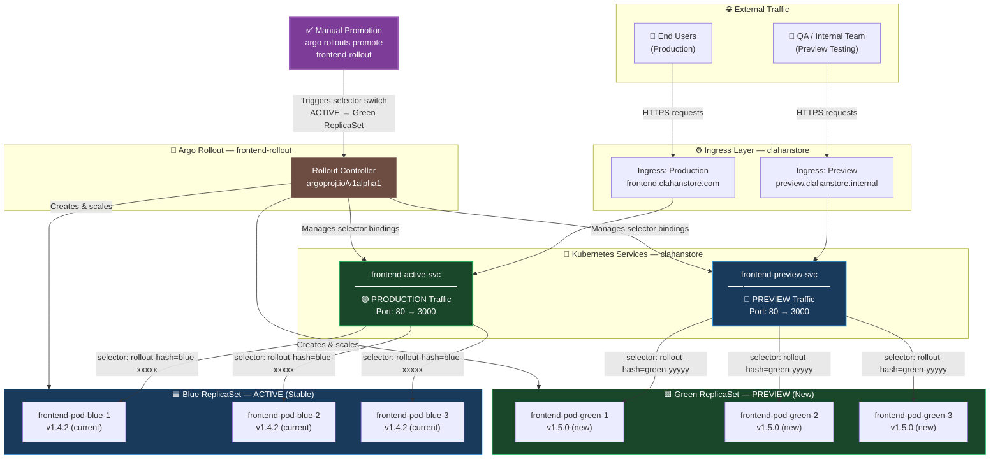
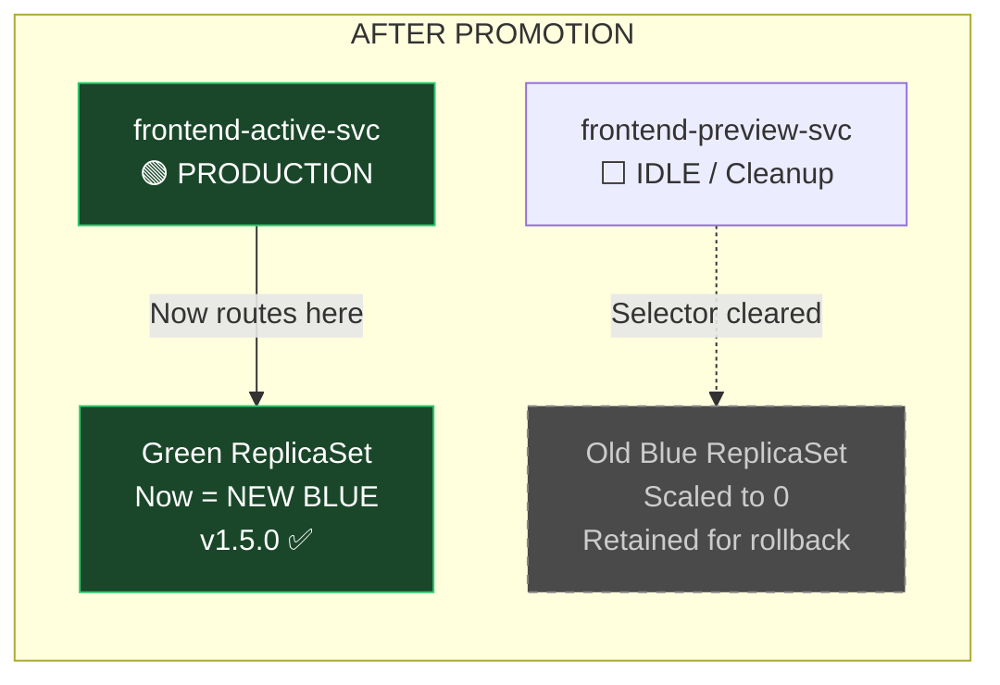

# Technical Manual: Continuous Deployment Pipeline
### Member 5 — CD Engineering Reference Guide
**Scope:** Argo CD + Argo Rollouts | `ecommerce-microservices/argo-deployments/`
**Environment:** `clahanstore` namespace | Production-Grade GitOps

---

## Table of Contents

1. [Tooling Overview](#1-tooling-overview)
2. [GitOps Storage Architecture](#2-gitops-storage-architecture)
3. [Argo CD Application Lifecycle](#3-argo-cd-application-lifecycle)
4. [Argo Rollouts — Blue-Green Strategy Deep Dive](#4-argo-rollouts--blue-green-strategy-deep-dive)
5. [Service Management Architecture](#5-service-management-architecture)
6. [Operational Flow — End-to-End Deployment](#6-operational-flow--end-to-end-deployment)
7. [Traffic Flow Diagram](#7-traffic-flow-diagram)
8. [CLI Reference & Runbook](#8-cli-reference--runbook)
9. [Failure Recovery Procedures](#9-failure-recovery-procedures)

---

## 1. Tooling Overview

### 1.1 Argo CD — GitOps Engine

Argo CD is the **primary reconciliation engine** for the entire `clahanstore` cluster state. It continuously monitors the Git repository as the declared source of truth and reconciles any divergence between the live cluster state and the committed manifests.

| Capability | Purpose in This Pipeline |
|---|---|
| **GitOps Sync** | Detects commits to `argo-deployments/` and applies changes |
| **Self-Heal** | Reverts any out-of-band manual `kubectl` changes |
| **Prune** | Removes cluster resources no longer declared in Git |
| **Application CRD** | Defines the target repo, path, and destination namespace |

### 1.2 Argo Rollouts — Progressive Delivery Controller

Argo Rollouts **replaces the standard Kubernetes `Deployment` resource** for the frontend service. It extends Kubernetes with CRD-based rollout strategies, enabling fine-grained traffic management that a native `Deployment` cannot provide.

| Capability | Purpose in This Pipeline |
|---|---|
| **Blue-Green Strategy** | Maintains two parallel environments simultaneously |
| **Preview Service** | Routes test traffic to the new (green) version |
| **Active Service** | Routes all production traffic to the stable (blue) version |
| **Manual Promotion** | Requires explicit human approval before traffic cutover |

> [!NOTE]
> Argo CD manages the **lifecycle** of the `Rollout` resource (creates, updates, deletes it), while Argo Rollouts manages the **deployment strategy** within that resource. These are two distinct controllers with complementary responsibilities.

---

## 2. GitOps Storage Architecture

### 2.1 The Repository as the Single Source of Truth

The Git repository is not merely a code store — it **is the cluster**. Every resource running in the `clahanstore` namespace must have a corresponding manifest committed to the `argo-deployments/` directory. Any resource that exists in the cluster but not in Git will be **pruned automatically**.

```
ecommerce-microservices/
└── argo-deployments/
    ├── argocd-application.yaml      # Argo CD Application definition
    └── frontend-rollout.yaml        # Argo Rollout + Service manifests
```

### 2.2 Manifest-to-Cluster Binding

The `argocd-application.yaml` creates a **direct, persistent binding** between the Git repository path and the Kubernetes cluster destination. This binding is not a one-time deployment trigger — it is a continuous watch loop.

```
┌─────────────────────────────────────────────────────────┐
│              argocd-application.yaml                     │
│                                                          │
│  source.repoURL  ──────────────────────────────────────► │ GitHub Repo
│  source.path     → argo-deployments/                    │
│  destination     → clahanstore namespace                 │
└─────────────────────────────────────────────────────────┘
              │
              │  Argo CD polls / receives webhook every ~3 min
              ▼
┌─────────────────────────────────────────────────────────┐
│           Live Kubernetes Cluster                        │
│   Namespace: clahanstore                                 │
│   Resources reconciled from Git manifests               │
└─────────────────────────────────────────────────────────┘
```

### 2.3 Source of Truth Enforcement Rules

| Rule | Mechanism | Effect |
|---|---|---|
| **No manual `kubectl apply`** | Self-Heal reverts within seconds | Manual changes are overwritten |
| **No orphaned resources** | Prune enabled | Resources deleted from Git are removed from cluster |
| **No config drift** | Continuous reconciliation loop | Cluster always mirrors Git state |

> [!WARNING]
> Never run `kubectl apply -f` or `kubectl edit` directly on any resource in the `clahanstore` namespace. Argo CD's self-heal will **immediately revert your changes**. All modifications must go through a Git commit and PR review process.

---

## 3. Argo CD Application Lifecycle

### 3.1 The `ecommerce-blue-green` Application Configuration

The `argocd-application.yaml` defines an Argo CD `Application` custom resource. This is the **root configuration object** for the entire CD pipeline. Below is a detailed breakdown of each significant field.

```yaml
# argo-deployments/argocd-application.yaml
apiVersion: argoproj.io/v1alpha1
kind: Application
metadata:
  name: ecommerce-blue-green         # Application identity in Argo CD UI
  namespace: argocd                  # Argo CD itself lives in 'argocd' namespace
spec:
  project: default

  source:
    repoURL: https://github.com/<org>/ecommerce-microservices
    targetRevision: HEAD             # Always tracks the latest commit on default branch
    path: argo-deployments           # Only watches this subdirectory

  destination:
    server: https://kubernetes.default.svc   # In-cluster API server
    namespace: clahanstore                   # Production isolation namespace

  syncPolicy:
    automated:
      prune: true                    # Delete resources removed from Git
      selfHeal: true                 # Revert out-of-band cluster changes
    syncOptions:
      - CreateNamespace=true         # Auto-creates 'clahanstore' if absent
```

### 3.2 Auto-Sync Behavior Explained

Auto-sync is the mechanism that makes this pipeline **fully automated from Git commit to cluster**. Understanding its sub-features is critical for safe operation.

#### `automated.prune: true`
When a resource manifest is **deleted from the Git repository**, Argo CD will delete the corresponding resource from the cluster on the next sync cycle. This prevents stale resources from accumulating in `clahanstore`.

**Example scenario:** If you remove a `ConfigMap` from `frontend-rollout.yaml` and commit, Argo CD will `kubectl delete` that `ConfigMap` from the cluster automatically.

#### `automated.selfHeal: true`
If any resource in `clahanstore` is modified directly (via `kubectl patch`, `kubectl edit`, or the Kubernetes dashboard), Argo CD will detect the divergence and **restore the Git-declared state within seconds**.

**Example scenario:** An engineer accidentally scales the rollout via `kubectl scale` — selfHeal will restore the replica count declared in `frontend-rollout.yaml` almost immediately.

#### `syncOptions: CreateNamespace=true`
The `clahanstore` namespace will be created automatically if it does not exist. This makes the pipeline **idempotent** — safe to run on a fresh cluster without pre-provisioning steps.

### 3.3 Application Health States

You will observe these states in the Argo CD UI. Understanding them is essential for incident response.

| State | Icon | Meaning |
|---|---|---|
| `Synced` | ✅ | Cluster matches Git exactly |
| `OutOfSync` | 🔄 | Git has changes not yet applied to cluster |
| `Progressing` | ⏳ | Resources are being applied / Rollout is in progress |
| `Degraded` | ❌ | One or more resources are unhealthy |
| `Suspended` | ⏸️ | Rollout is paused awaiting manual promotion |

> [!IMPORTANT]
> The `Suspended` state is **expected and correct behavior** during a Blue-Green rollout. When you see this state, it means the Preview environment is live and awaiting your manual verification before promotion. Do **not** treat `Suspended` as an error.

---

## 4. Argo Rollouts — Blue-Green Strategy Deep Dive

### 4.1 Why `Rollout` Instead of `Deployment`

The `frontend-rollout.yaml` defines an `argoproj.io/v1alpha1 Rollout` resource rather than a standard `apps/v1 Deployment`. This is a **deliberate architectural choice** because:

- A native `Deployment` performs rolling updates with no traffic isolation — new pods receive production traffic immediately
- An Argo `Rollout` with Blue-Green strategy **keeps new pods completely isolated** from production traffic until manually promoted
- This provides a **zero-risk verification window** where QA and stakeholders can test the new version on real infrastructure before any customer is impacted

### 4.2 The `frontend-rollout` Resource Configuration

```yaml
# argo-deployments/frontend-rollout.yaml
apiVersion: argoproj.io/v1alpha1
kind: Rollout
metadata:
  name: frontend-rollout
  namespace: clahanstore
spec:
  replicas: 3
  selector:
    matchLabels:
      app: frontend
  template:
    metadata:
      labels:
        app: frontend
    spec:
      containers:
        - name: frontend
          image: <registry>/frontend:latest   # Updated by CI pipeline via image tag
          ports:
            - containerPort: 3000

  strategy:
    blueGreen:
      # Production traffic — stable/active version
      activeService: frontend-active-svc

      # Staging traffic — new/preview version
      previewService: frontend-preview-svc

      # CRITICAL: Requires manual promotion command
      autoPromotionEnabled: false
```

### 4.3 `autoPromotionEnabled: false` — Why This Matters

This is the **single most important configuration decision** in the entire CD pipeline. Here is the explicit reasoning:

| Setting | Behavior | Risk Level |
|---|---|---|
| `autoPromotionEnabled: true` | New version automatically becomes active after health checks pass | **High** — No human verification window |
| `autoPromotionEnabled: false` | Rollout pauses at Preview stage indefinitely until manually promoted | **Low** — Full human control over production cutover |

For a production e-commerce platform, an automated promotion means a bad frontend deployment (broken checkout flow, CSS regression, JavaScript error) would reach **100% of customers** before anyone can intervene. Manual promotion ensures that a human has verified the preview environment on `frontend-preview-svc` before any customer traffic is switched.

> [!IMPORTANT]
> **Manual Promotion is a Required Step — Not Optional.**
>
> After a new deployment reaches the `Suspended` state, the Rollout **will not automatically proceed**. Production traffic continues flowing to the current active (blue) version indefinitely. You are responsible for:
> 1. Verifying the preview (green) environment on `frontend-preview-svc`
> 2. Confirming sign-off from QA or a stakeholder
> 3. Executing the promotion command to switch production traffic
>
> Skipping verification and promoting immediately defeats the entire purpose of the Blue-Green strategy.

---

## 5. Service Management Architecture

### 5.1 Dual-Service Model

The Blue-Green strategy requires **two Kubernetes Services** pointing to the same pod selector but managed by the Rollout controller to dynamically switch their endpoints.

```yaml
# frontend-active-svc — Production traffic (BLUE)
apiVersion: v1
kind: Service
metadata:
  name: frontend-active-svc
  namespace: clahanstore
spec:
  selector:
    app: frontend
  ports:
    - port: 80
      targetPort: 3000
  type: ClusterIP

---
# frontend-preview-svc — Staging/testing traffic (GREEN)
apiVersion: v1
kind: Service
metadata:
  name: frontend-preview-svc
  namespace: clahanstore
spec:
  selector:
    app: frontend
  ports:
    - port: 80
      targetPort: 3000
  type: ClusterIP
```

> [!NOTE]
> Both services appear identical in their static YAML definition. The Argo Rollouts controller **dynamically manages the pod selectors** on these services at runtime by injecting a rollout-specific hash label (`rollouts-pod-template-hash`) to route each service to the correct ReplicaSet. You do not need to manage these labels manually.

### 5.2 Service Role Reference Table

| Service | Traffic Type | Version Served | Modified by Rollout Controller |
|---|---|---|---|
| `frontend-active-svc` | **Production** (all customer traffic) | Current stable (Blue) | Selector updated **after** promotion |
| `frontend-preview-svc` | **Preview** (QA/internal testing only) | New version (Green) | Selector updated **when** new ReplicaSet is created |

### 5.3 Ingress / Load Balancer Integration

Your ingress controller (NGINX, AWS ALB, etc.) should point to `frontend-active-svc` **only**. The `frontend-preview-svc` should be accessible internally or via a separate internal ingress rule for verification purposes. This ensures that:

- External customers always hit `frontend-active-svc` → stable version
- QA team hits `frontend-preview-svc` → new version for verification

---

## 6. Operational Flow — End-to-End Deployment

### 6.1 Complete Step-by-Step Walkthrough

```
STEP 1: Developer commits updated image tag or manifest change to Git
         └── PR reviewed and merged to main branch

STEP 2: Argo CD detects divergence between Git HEAD and cluster state
         └── Auto-sync triggers within ~3 minutes (or immediately via webhook)
         └── Argo CD applies the updated Rollout manifest to clahanstore

STEP 3: Argo Rollouts controller detects spec change in frontend-rollout
         └── Creates NEW ReplicaSet (Green) with updated pod template
         └── Binds frontend-preview-svc selector to the Green ReplicaSet
         └── Active production traffic continues on Blue ReplicaSet (no impact)
         └── Rollout enters 'Paused / Suspended' state

STEP 4: Verification window
         └── QA team tests via frontend-preview-svc endpoint
         └── Smoke tests, functional tests, visual regression checks
         └── Stakeholder sign-off obtained

STEP 5: Manual Promotion executed by Member 5 or authorized team member
         └── argocd app actions run ecommerce-blue-green --kind Rollout \
               --resource-name frontend-rollout promote
         └── OR: kubectl argo rollouts promote frontend-rollout -n clahanstore

STEP 6: Argo Rollouts switches frontend-active-svc selector to Green ReplicaSet
         └── Production traffic now flows to new version (Green → becomes new Blue)
         └── Old ReplicaSet (previous Blue) is retained briefly for rollback
         └── Rollout state returns to 'Healthy'
```

### 6.2 Deployment State Machine

```
[Git Commit Merged]
       │
       ▼
[Argo CD Detects OutOfSync]
       │
       ▼
[Argo CD Auto-Sync Triggered]
       │
       ▼
[Rollout Controller Creates Green ReplicaSet]
       │
       ▼
[Preview Service → Green Pods]       [Active Service → Blue Pods (unchanged)]
       │
       ▼
[Rollout State: SUSPENDED ⏸️]
       │
       ▼  ◄─── HUMAN VERIFICATION REQUIRED HERE
       │
  [Promote Command Issued]
       │
       ▼
[Active Service → Green Pods]        [Blue ReplicaSet scaled to 0 / retained]
       │
       ▼
[Rollout State: HEALTHY ✅]
```

---

## 7. Traffic Flow Diagram

The following Mermaid.js diagram illustrates the complete traffic flow architecture during an active Blue-Green rollout, from external user request through to the versioned pod sets.



### 7.1 Post-Promotion Traffic Flow

After the promotion command is executed, the Rollout controller **atomically switches** the `frontend-active-svc` selector from the Blue ReplicaSet to the Green ReplicaSet. The transition from the user perspective is seamless — in-flight requests complete on Blue pods while new connections are routed to Green pods.



---

## 8. CLI Reference & Runbook

### 8.1 Daily Monitoring Commands

```bash
# Check Argo CD application sync status
argocd app get ecommerce-blue-green

# Watch live sync status in terminal
argocd app get ecommerce-blue-green --watch

# List all resources managed by the application
argocd app resources ecommerce-blue-green

# Check Rollout status (most important during deployments)
kubectl argo rollouts get rollout frontend-rollout \
  --namespace clahanstore \
  --watch

# Quick status check without watch
kubectl argo rollouts status frontend-rollout \
  --namespace clahanstore
```

### 8.2 Deployment Trigger (If Not Auto-Syncing)

```bash
# Manually trigger a sync if auto-sync hasn't fired
argocd app sync ecommerce-blue-green

# Force sync with prune (removes orphaned resources)
argocd app sync ecommerce-blue-green --prune

# Sync with a specific Git revision (for rollback to previous commit)
argocd app sync ecommerce-blue-green \
  --revision <commit-sha>
```

### 8.3 The Promotion Command

> [!IMPORTANT]
> **This command switches production traffic.** Confirm the following before executing:
> - [ ] Preview environment tested on `frontend-preview-svc`
> - [ ] No errors in preview pod logs (`kubectl logs -l app=frontend -n clahanstore`)
> - [ ] QA sign-off received (Slack/Jira ticket confirmation)
> - [ ] Rollback procedure understood (Section 9.1)

```bash
# METHOD 1: Via Argo Rollouts CLI (Recommended)
kubectl argo rollouts promote frontend-rollout \
  --namespace clahanstore

# METHOD 2: Via Argo CD Application Actions
argocd app actions run ecommerce-blue-green promote \
  --kind Rollout \
  --resource-name frontend-rollout

# METHOD 3: Via Argo CD UI
# Navigate to: ecommerce-blue-green → frontend-rollout → Actions → Promote
```

### 8.4 Image Tag Update (Triggering a New Rollout)

```bash
# Update the image tag in the rollout (do this via Git commit, not directly)
# For emergency hotfix only — commit to Git immediately after:
kubectl argo rollouts set image frontend-rollout \
  frontend=<registry>/frontend:<new-tag> \
  --namespace clahanstore
```

> [!CAUTION]
> Using `kubectl argo rollouts set image` directly modifies the cluster without a Git commit. Argo CD's self-heal will revert this change. This command should only be used in a genuine emergency. Always follow up with a Git commit to sync the declared state.

### 8.5 Verification Commands During Preview Phase

```bash
# Check preview pods are running and healthy
kubectl get pods -n clahanstore \
  -l rollouts-pod-template-hash=<green-hash>

# View logs from preview (green) pods
kubectl logs -n clahanstore \
  -l app=frontend \
  --prefix=true \
  --since=10m

# Port-forward to preview service for local testing
kubectl port-forward svc/frontend-preview-svc \
  8080:80 \
  --namespace clahanstore

# Describe the current rollout state
kubectl describe rollout frontend-rollout \
  --namespace clahanstore
```

---

## 9. Failure Recovery Procedures

### 9.1 Rollback During Preview Phase (Before Promotion)

If issues are found during preview verification, **no production traffic was affected**. Simply abort the rollout:

```bash
# Abort the rollout — scales down Green, keeps Blue as active
kubectl argo rollouts abort frontend-rollout \
  --namespace clahanstore

# Verify rollout returned to stable state
kubectl argo rollouts get rollout frontend-rollout \
  --namespace clahanstore

# Revert the Git commit that caused the bad deployment
git revert <commit-sha>
git push origin main
```

### 9.2 Rollback After Promotion (Production Impact)

If issues are detected **after** the promotion command has been executed and production traffic is on the new version:

```bash
# Immediate rollback to previous ReplicaSet
kubectl argo rollouts undo frontend-rollout \
  --namespace clahanstore

# Monitor the rollback
kubectl argo rollouts get rollout frontend-rollout \
  --namespace clahanstore \
  --watch
```

Simultaneously, revert the Git commit so Argo CD doesn't re-apply the broken version:

```bash
# In Git — create a revert commit
git revert <merge-commit-sha>
git push origin main

# Verify Argo CD re-syncs to the reverted state
argocd app sync ecommerce-blue-green
```

> [!WARNING]
> After a rollback, the Rollout controller will attempt to reconcile again on the next Argo CD sync unless the Git commit is also reverted. **Always revert the Git commit alongside the kubectl rollback** to prevent Argo CD from re-applying the broken version automatically.

### 9.3 Argo CD Out-of-Sync Recovery

```bash
# If application is stuck OutOfSync, force a hard refresh
argocd app get ecommerce-blue-green --hard-refresh

# If resources are in a failed state, delete and let Argo CD recreate
kubectl delete rollout frontend-rollout -n clahanstore
argocd app sync ecommerce-blue-green
```

### 9.4 Health Check Quick Reference

```bash
# Full namespace health snapshot
kubectl get all -n clahanstore

# Check Argo CD controller logs (if sync is not triggering)
kubectl logs -n argocd \
  deployment/argocd-application-controller \
  --tail=100

# Check Argo Rollouts controller logs (if promotion is not working)
kubectl logs -n argo-rollouts \
  deployment/argo-rollouts \
  --tail=100
```

---

## Appendix: Configuration File Quick Reference

| File | Kind | Key Fields |
|---|---|---|
| `argocd-application.yaml` | `Application` | `source.path`, `syncPolicy.automated`, `destination.namespace` |
| `frontend-rollout.yaml` | `Rollout` | `strategy.blueGreen`, `activeService`, `previewService`, `autoPromotionEnabled` |

## Appendix: Key Contacts & Escalation

| Role | Responsibility | Escalate When |
|---|---|---|
| **Member 5 (You)** | CD pipeline, Argo CD, promotions | Always first point of contact |
| **QA Lead** | Preview environment sign-off | Required before any promotion |
| **Backend Lead** | API contract verification during preview | API changes in the release |
| **DevOps Lead** | Argo CD controller issues, cluster-level failures | Self-heal not working, controller crashes |

---

*Document Owner: Member 5 — CD Pipeline Engineering*
*Last Updated: Refer to Git commit history for `argo-deployments/`*
*Review Cycle: Update this document with every architectural change to the CD pipeline*